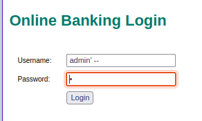
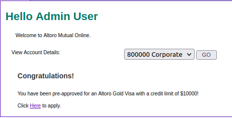
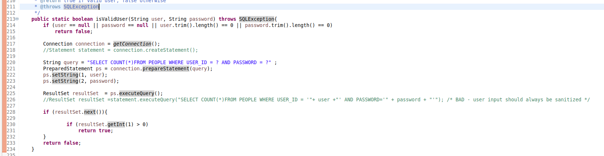

# Desarrollo de Software Seguro - Práctico 2

A continuación, se muestran 8 vulnerabilidades presentes en el software proporcionado de Altoro. Para cada vulnerabilidad, se muestra una prueba de concepto de cómo explotarla y una solución para mitigarla.

## Vulnerabilidad 1 – Cross Site Scripting

Existe un cross site scripting (XSS) en el parámetro query de la url search.jsp, lo que permite manipular los datos que se introducen desde la petición web para inyectar scripts maliciosos.

Esto se debe a que los datos de entrada en el parámetro de entrada no son neutralizados antes de ser utilizados. Para mitigar este problema, se puede usar el método ServletUtil.sanitizeHtmlWithRegex() sobre los datos de entrada antes de utilizarlos para realizar operaciones de búsqueda.

Luego de realizar los ajustes en el código, no se ejecuta el script ingresado desde la url.

## Vulnerabilidad 2  – SQL Injection
Existe una inyección SQL en la funcionalidad de login, lo que permite acceder al sistema sin conocer la contraseña.

Se puede observar que independientemente de la contraseña que se ingrese se logra acceder al sistema:

Este código es vulnerable a SQL Injection porque concatena directamente las entradas del usuario (user y password) en la consulta SQL sin ninguna sanitización. 
Al no estar sanitizadas, cuando se le ingresa: admin' -- en el campo de usuario y cualquier valor en el campo de contraseña, pasa la validación previa porque ambos campos contienen algún valor y la consulta SQL que se genera entonces se convierte en:
SELECT COUNT(*) FROM PEOPLE WHERE USER_ID = 'admin' --' AND PASSWORD = '...'
La parte -- que se encuentra luego del admin, comenta el resto de la consulta, evadiendo el control de la password y permitiendo el acceso.

Para mitigar esta vulnerabilidad, se debes utilizar sentencias preparadas (Prepared Statements), que aseguran que las entradas del usuario no se interpreten como parte del código SQL.

Se puede observar que luego del ajuste, cuando se intenta ingresar con el uso de la inyeccion, se visualiza un error, es decir, se controla exitosamente los datos ingresados.

## Vulnerabilidad 3

## Vulnerabilidad 4

## Vulnerabilidad 5

## Vulnerabilidad 6

## Vulnerabilidad 7

## Vulnerabilidad 8
