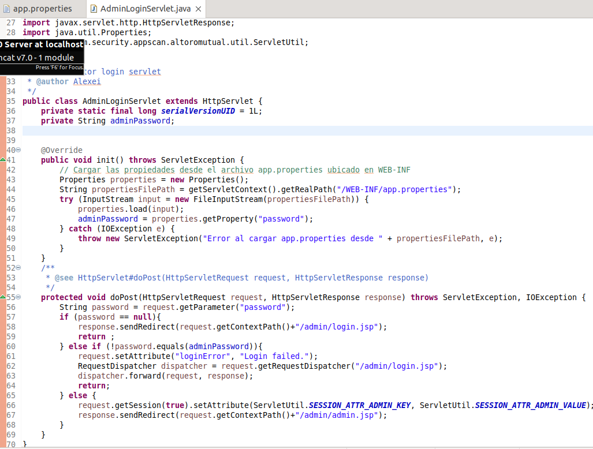

# Desarrollo de Software Seguro - Práctico 2

A continuación, se muestran 8 vulnerabilidades presentes en el software proporcionado de Altoro. Para cada vulnerabilidad, se muestra una prueba de concepto de cómo explotarla y una solución para mitigarla.

## Vulnerabilidad 1 – Cross Site Scripting

Existe un cross site scripting (XSS) en el parámetro query de la url search.jsp, lo que permite manipular los datos que se introducen desde la petición web para inyectar scripts maliciosos.

Esto se debe a que los datos en el parámetro de entrada no son neutralizados antes de ser utilizados. Para mitigar este problema, se puede usar el método ServletUtil.sanitizeHtmlWithRegex() sobre los datos de entrada antes de utilizarlos para realizar operaciones de búsqueda.

Luego de realizar los ajustes en el código, no se ejecuta el script ingresado desde la url.

## Vulnerabilidad 2  – SQL Injection
Se puede realizar una inyección SQL en la funcionalidad de login, lo que permite acceder al sistema sin conocer la contraseña.

Se puede observar que independientemente de la contraseña que se ingrese se logra acceder al sistema:

Este código es vulnerable a SQL Injection porque concatena directamente las entradas del usuario (user y password) en la consulta SQL sin ninguna sanitización. 
Al no estar sanitizadas, cuando se le ingresa: admin' -- en el campo de usuario y cualquier valor en el campo de contraseña, pasa la validación porque ambos campos contienen algún valor y la consulta SQL que se genera se convierte en:

**SELECT COUNT(*) FROM PEOPLE WHERE USER_ID = 'admin'** --'AND PASSWORD = '...'

Los guiones -- que se encuentran luego del 'admin', comentan el resto de la consulta, evadiendo el control de la password y permitiendo el acceso.

Para mitigar esta vulnerabilidad, se debes utilizar sentencias preparadas (Prepared Statements), que aseguran que las entradas del usuario no se interpreten como parte del código SQL.

Se puede observar que luego del ajuste, cuando se intenta ingresar con el uso de la inyeccion, se visualiza un error, es decir, se controla exitosamente los datos ingresados.

## Vulnerabilidad 3 – Improper Input Validation 

Al consultar el historial de una cuenta, el número de cuenta puede ser modificado desde la URL. Esto permite que el usuario pueda ingresar caractéres no válidos como letras o símbolos.

Como no se valida que el dato ingresado sea un número, se muestra el mensaje de error arrojado por la excepción de Java al intentar parsear un string a long.

Para mitigar el problema, se puede validar que el dato de entrada sea numérico antes de procesarlo en el archivo balance.jsp. En caso de que no lo sea, el usuario será redirigido a una página no encontrada.

## Vulnerabilidad 4  – OS Command Injection

Se puede realizar una inyección de comando en el parámetro content de la página index.jsp.

El comando touch se usa para crear archivos vacíos en el sistema de archivos. En este ejemplo, el atacante creó un archivo llamado algo en la carpeta /home/user/.

El comando cat es utilizado para mostrar el contenido de un archivo en la terminal. En este caso, el atacante pidió ver el archivo /etc/passwd, el cual contiene información sobre las cuentas de usuario del sistema.

Para mitigar este problema, se debe sanitizar el paramétro content y evitar el uso de comandos del sistema operativo, utilizando APIs de Java para manejar archivos directamente.

Al realizar los ajustes en el código, utilizamos una expresión regular para asegurarnos de que solo se acepten nombres de archivos válidos y evitar la inyección de comandos maliciosos.

Además, evitamos utilizar Runtime.exec(), usando clases de Java como FileReader y BufferedReader para leer los archivos directamente, eliminando la necesidad de ejecutar comandos del sistema operativo.

Por último, tambien manejamos las excepciones. Si el archivo no existe o no se puede leer de forma segura, el usuario es redirigdo a una página no encontrada.

Ahora, al ingresar de nuevo los comandos en la url, estos no se ejecutan y el usuario es redirigido.

## Vulnerabilidad 5

## Vulnerabilidad 6 – Use of Hard-coded Credentials 

En la interfaz de administración (/AltoroJ/admin/login.jsp) se utiliza una clave codificada directamente en el código fuente.

Esto implica una vulnerabilidad porque un atacante puede revisar el codigo fuente por ejemplo a traves de las herramientas de desarrollo (f12), y obtener la password.

Ademas desde "/AltoroJ/src/com/ibm/security/appscan/altoromutual/servlet/AdminLoginServlet.java", se utiliza la password hardcodeada.

**Para mitigar dicho comportamiento:**

Se retiro la misma del archivo login.jsp, y se la guardo en el archivo app.properties.

Luego desde el AdminLoginServlet.java, se llama a la contraseña cargando el archivo de app.properties.

## Vulnerabilidad 7 – Missing Authorization

Se encontro que existe una vulnerabilidad de Missing Authorization, al visualizar las historias.
Se ingreso como el usuario "jsmith", el cual tenia 3 opciones para seleccionar: 800003, 800002 o 4539082039396288, para visualizar la historia.

Se encontro que luego de ingresar, en la url se veia el numero del mismo, y cambiandolo se lograba acceder a la historia de otro usuario, lo cual no deberia tener permitido visualizar.

Para mitigar el problema, se puede modificar el código en el archivo balance.jsp para validar que el número de cuenta ingresado coincida con alguno de los números de cuenta del usuario. En caso de que no coincida, el usuario es redirigido a una página no encontrada.

## Vulnerabilidad 8
